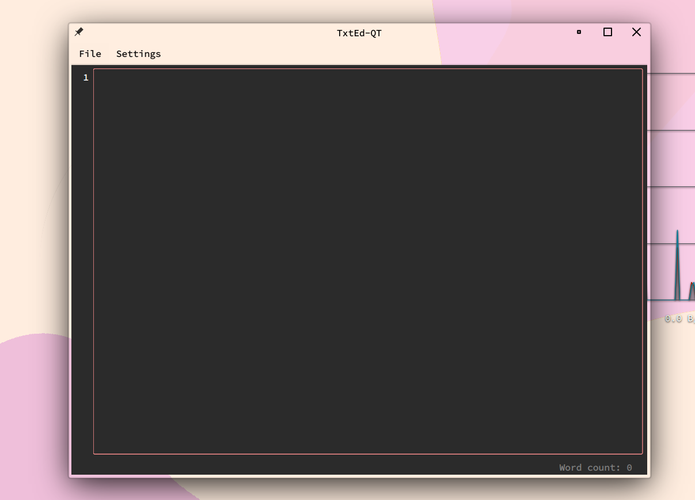

#  TxtEd
Simple text editor.

**Dependancies:**

- [python](https://archlinux.org/packages/core/x86_64/python/)
- [python-pyqt6](https://archlinux.org/packages/extra/x86_64/python-pyqt6/)
- [python-pyqt6-webengine](https://archlinux.org/packages/extra/x86_64/python-pyqt6-webengine/)
- [python-pygments](https://archlinux.org/packages/extra/any/python-pygments/)

***NOTE: The above are archlinux packages, review your distro's specific for the appropriate deps.***

**How to use:**

1. Clone repository.

    git clone https://github.com/l0vemimi/TxtEd.git

2. Move the the .desktop folder to ~/.local/share/applications.

    mv txted-qt6.desktop ~/.local/share/applications

Make sure to edit the .desktop file to your own specifications e.g. dir of txted-qt6.py and txt-qt.png for the application img.

3. Run the app.

**To run it just with py:**

1. Run the .py file.

    python txted-qt6.py

You can create a bash alias for automation if CLI is preffered e.g.

    alias txted='python /dir/to/file/txted-qt6.py

Then to run it:

    txted

    
<b>Keyboard Shortcuts:</b>

Save = CTRL + s

Copy = CTRL + c

Cut = CTRL + x

Paste = CTRL + v

Zoom In = CTRL + +

Zoom Out = CTRL + -

