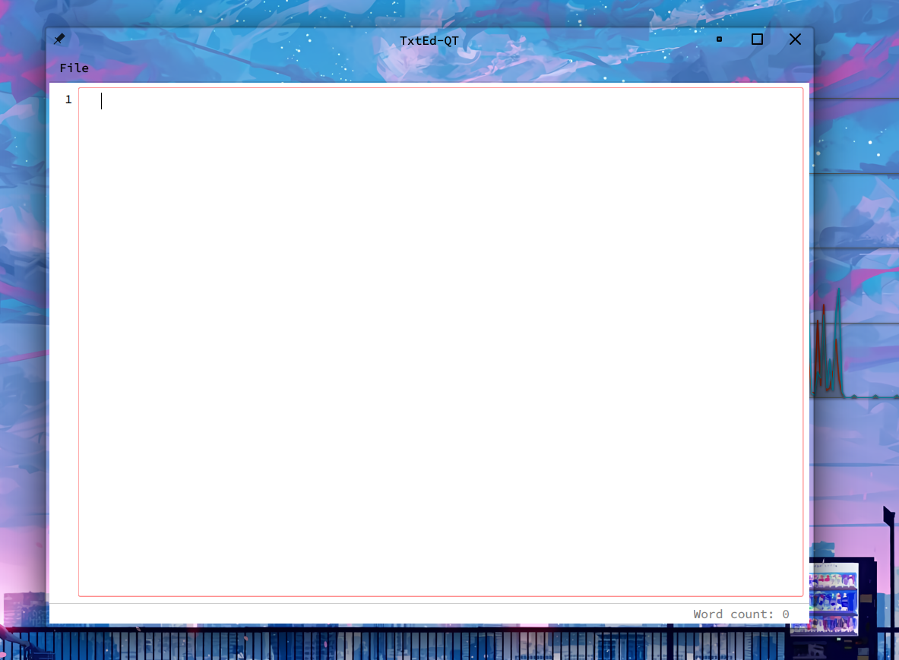
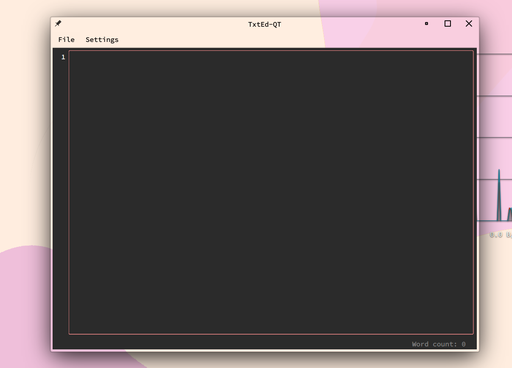

### Simple text editor.

**Package Dependancies:**

- [python](https://archlinux.org/packages/core/x86_64/python/)
- [python-pyqt6](https://archlinux.org/packages/extra/x86_64/python-pyqt6/)
- [python-pyqt6-webengine](https://archlinux.org/packages/extra/x86_64/python-pyqt6-webengine/)
- [python-pygments](https://archlinux.org/packages/extra/any/python-pygments/)

*NOTE: The above are archlinux packages, review your distro's specific for the appropriate deps.*

**How to use:**

**I. From Source:**

1. Clone repository:

        git clone https://github.com/l0vemimi/TxtEd.git

2. Build the package:

        makepkg -si

4. Run the app.

**II. Py:**

1. Run the .py file.

        python txted-qt6.py

1.2. You can create a bash alias for automation if CLI is preffered e.g.

        alias txted='python /dir/to/file/txted-qt6.py'

1.2.1. Then to run it:

        txted

**III. Pacman:**

1. Download the .tar.gz at [l0vemimi/ArchPkg](https://github.com/l0vemimi/ArchPkg/blob/main/repo/x86_64/TxtEd-1.2-1-any.pkg.tar.zst) 

Or.. 

1.2. Clone the whole repo..

        git clone https://github.com/l0vemimi/ArchPkg.git

1.2.1. Find the package file *repo/x86_64/TxtEd-1.2-1-any.pkg.tar.zst*.

2. Add the package tar to your repo db:

        repo-add repo/x86_64/[YOUR_REPO].db.tar.gz repo/x86_64/TxtEd-1.2-1-any.pkg.tar.zst

3. Update pacman:

        sudo pacman -Sy

*NOTE: If you do not have your own repository, see my other repo [l0vemimi/ArchBtw](https://github.com/l0vemimi/ArchBtw) and the [makepkg](https://l0vemimi.github.io/ArchBtw/makepkg/) section in the gitbook.*

    
<b>Keyboard Shortcuts:</b>

Save = CTRL + s

Copy = CTRL + c

Cut = CTRL + x

Paste = CTRL + v

Zoom In = CTRL + +

Zoom Out = CTRL + -

